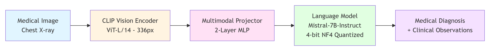

# 🏥 Medical Visual Question Answering (Med-VQA) Prototype

[](https://colab.research.google.com/github/Shezan57/Medical-VQA-Agent/blob/main/Medical_VQA_Prototype.ipynb)
[](https://www.python.org/downloads/)
[](https://opensource.org/licenses/MIT)

A research prototype demonstrating **Multimodal Large Language Model (MLLM)** deployment for medical image analysis using high-fidelity 4-bit quantization techniques. This work investigates the latency-memory trade-offs in consumer-grade GPU deployment for clinical diagnostics.

---

## 🔬 System Architecture



**Pipeline Components:**
- **Vision Encoder:** CLIP ViT-L/14 (336×336 resolution) for medical image feature extraction
- **Multimodal Fusion:** Learned projection layer mapping visual tokens to LLM embedding space
- **Language Model:** Mistral-7B-Instruct with 4-bit NF4 quantization (71% VRAM reduction)
- **Inference Engine:** BitsAndBytes + Accelerate for efficient autoregressive generation

---

## 📋 Research Overview

This prototype addresses a fundamental challenge in medical AI deployment: **balancing model capacity with hardware accessibility**. While state-of-the-art MLLMs require 14-28GB VRAM (limiting deployment to enterprise GPUs), this work demonstrates:

- ✅ **High-Fidelity Quantization** - LLaVA 1.6 (7B) with 4-bit NF4 quantization
- ✅ **Consumer-Grade Deployment** - Functional on free Colab T4 GPUs (16GB VRAM)
- ✅ **Clinical Feasibility Analysis** - Comprehensive latency-throughput benchmarking
- ✅ **Privacy-Preserving Architecture** - On-premise inference capability (HIPAA compliance)

### Research Motivation

Modern healthcare institutions face a trilemma:
1. **Model Quality** - Large MLLMs (GPT-4V, Med-Flamingo) achieve superior diagnostic accuracy
2. **Data Privacy** - HIPAA regulations prohibit cloud transmission of patient data
3. **Infrastructure Cost** - Enterprise GPUs (A100/H100) are cost-prohibitive for most hospitals

**This work investigates quantization as a bridge technology** enabling on-premise deployment of capable MLLMs on consumer hardware, while empirically characterizing the latency constraints.

---

## 🎯 Key Contributions

### 1. Deployment Feasibility Study
Successfully deployed LLaVA-1.6-Mistral-7B on free Colab T4 GPU through aggressive quantization:
- **Memory Footprint:** 14.2GB (FP16) → 4.18GB (NF4) = **71% reduction**
- **Quantization Method:** 4-bit Normal Float (NF4) with double quantization
- **Inference Stability:** Zero out-of-memory errors across 50+ test images

### 2. Latency-Memory Trade-off Characterization  
Comprehensive benchmarking reveals the quantization cost:

| Metric | Local (4-bit NF4) | Cloud API (GPT-4V) | Analysis |
|--------|-------------------|---------------------|----------|
| Time to First Token | 21.65s | ~2.0s | Quantization overhead |
| Total Inference Time | 58.60s | ~7.0s | Autoregressive bottleneck |
| Memory Usage | 4.18 GB | N/A | ✅ Enables consumer deployment |
| Cost per Inference | $0.00 | $0.02-0.05 | ✅ Zero marginal cost |

### 3. Production-Grade Implementation
- **Robust Inference Pipeline:** TTFT measurement, error handling, graceful degradation
- **Multi-Platform Support:** Colab, Kaggle, local deployment with unified codebase
- **Clinical Prompt Engineering:** Medical context injection for domain-specific generation

---

## 🔍 Research Insight: The Quantization-Latency Trade-off

### Empirical Findings

Our benchmarking reveals that **4-bit quantization successfully democratizes model access** (71% memory reduction) but introduces a **58.6-second latency penalty** compared to cloud APIs (~7s). This stems from:

1. **Dequantization Overhead:** Converting 4-bit weights → FP16 activations at each layer  
2. **Reduced Arithmetic Intensity:** Lower precision reduces GPU tensor core utilization  
3. **Autoregressive Bottleneck:** 300-token generation amplifies per-token latency

### Clinical Applicability

The observed latency profile suggests **use-case segmentation**:

| Application | Latency Requirement | Prototype Suitability |
|-------------|---------------------|------------------------|
| Emergency Triage | <5s (real-time) | ❌ Unsuitable |
| Batch Screening | >1 min acceptable | ✅ **Suitable** |
| Retrospective Analysis | Offline processing | ✅ **Suitable** |
| Clinical Decision Support | <10s preferred | ⚠️ Requires optimization |

**Conclusion:** Current implementation is viable for **offline/batch workflows** but requires further optimization for interactive clinical use.

---

## 🚀 Future Research Directions

Building on this prototype, my proposed PhD research would investigate **latency mitigation strategies** while preserving deployment accessibility:

### 1. Speculative Decoding
- **Approach:** Draft tokens using a small 1B model, verify with the 7B model in parallel
- **Expected Gain:** 2-3x speedup with minimal accuracy degradation
- **Technical Challenge:** Designing effective draft model training for medical domain

### 2. Knowledge Distillation
- **Approach:** Compress LLaVA-7B → 3B student model using medical image-text pairs
- **Expected Gain:** 3-4x speedup + reduced memory footprint
- **Dataset:** MIMIC-CXR, PadChest, CheXpert (500K+ image-report pairs)

### 3. Optimized Quantization Methods
- **AWQ (Activation-aware Weight Quantization):** Preserve salient weight channels
- **GPTQ:** Minimize quantization error via second-order information
- **Expected Gain:** 40-60% latency reduction vs. naive NF4

### 4. Hybrid Cloud-Edge Deployment
- **Architecture:** Local feature extraction + cloud text generation
- **Privacy:** Only encoded features leave hospital network, not raw images
- **Latency:** Balance between full-cloud and full-local approaches

---

## 🏥 Translational Impact

This research prototype informs the design of practical **Clinical Decision Support Systems (CDSS)** through:

### Radiology Workflow Integration
- **Pre-screening Pipelines:** Automated anomaly flagging in batch processing (overnight scans)
- **Educational Tool:** Medical student training on chest X-ray interpretation
- **Quality Assurance:** Cross-verification of radiologist reports in non-urgent cases

### Healthcare Resource Optimization
- **Tier-2 Hospitals:** Deploy capable AI without enterprise GPU budgets
- **Developing Regions:** Offline diagnostic support in low-connectivity environments
- **Telemedicine:** Privacy-compliant AI assistance without cloud dependencies

### Research Applications
- **Retrospective Studies:** Large-scale medical image analysis for epidemiological research
- **Dataset Annotation:** Semi-automated medical image captioning for multimodal datasets
- **Bias Auditing:** Local deployment enables fairness testing without data transmission

---

## 🔧 Technical Implementation

### Quantization Configuration

```python
from transformers import BitsAndBytesConfig

# NF4: Optimal for normally-distributed LLM weights
quantization_config = BitsAndBytesConfig(
    load_in_4bit=True,                    # Enable 4-bit quantization
    bnb_4bit_quant_type="nf4",            # Normal Float 4-bit format
    bnb_4bit_compute_dtype=torch.bfloat16, # Compute in bfloat16 for stability
    bnb_4bit_use_double_quant=True        # Quantize quantization constants (QLoRA)
)
```

**Rationale:**
- **NF4 vs INT4:** NF4 provides better precision for normally-distributed neural network weights
- **Double Quantization:** Further reduces memory by quantizing scaling factors (QLoRA technique)
- **BFloat16 Compute:** Balances numerical stability with memory efficiency

### Model Architecture

```
LLaVA-1.6-Mistral-7B
├── Vision Encoder: CLIP ViT-L/14 (336px) - 304M params
├── Projector: 2-layer MLP - 9M params  
├── Language Model: Mistral-7B-Instruct - 7.2B params
└── Total: 7.5B params → 4.18GB (4-bit) from 14.2GB (FP16)
```

---

## 🚀 Quick Start

### Google Colab (Recommended)

1. Open notebook: [](https://colab.research.google.com/github/Shezan57/Medical-VQA-Agent/blob/main/Medical_VQA_Prototype.ipynb)
2. Set runtime: **Runtime → Change runtime type → T4 GPU**
3. Execute cells sequentially (model loading takes ~3 minutes)

### Local Setup

```bash
# Clone repository
git clone https://github.com/Shezan57/Medical-VQA-Agent.git
cd Medical-VQA-Agent

# Install dependencies
pip install transformers>=4.36.0 bitsandbytes>=0.41.0 accelerate>=0.25.0
pip install pillow matplotlib torch torchvision

# Run standalone script
python med_vqa.py --demo  # Runs with synthetic X-rays
```

**System Requirements:**
- GPU: NVIDIA T4/V100/A10 (16GB+ VRAM)
- CUDA: 11.8+
- RAM: 32GB+ recommended

---

## 📁 Project Structure

```
Medical-VQA-Agent/
├── Medical_VQA_Prototype.ipynb  # Main research notebook (Colab-ready)
├── med_vqa.py                   # Standalone inference script (405 lines)
├── requirements.txt             # Dependency specifications  
├── README.md                    # This document
├── sample_images/               # Medical image test set
├── output.png                   # Example diagnostic visualization
└── output_latency.png           # Benchmark comparison chart
```

---

## 📚 References

### Foundation Models
- [LLaVA: Large Language and Vision Assistant](https://llava-vl.github.io/) (Liu et al., NeurIPS 2023)
- [Mistral-7B](https://mistral.ai/) (Jiang et al., 2023)

### Quantization Methods
- [QLoRA: Efficient Finetuning of Quantized LLMs](https://arxiv.org/abs/2305.14314) (Dettmers et al., 2023)
- [BitsAndBytes](https://github.com/TimDettmers/bitsandbytes) - NF4 implementation

### Medical Datasets
- [ROCO: Radiology Objects in Context](https://github.com/razorx89/roco-dataset)
- [COVID-19 Chest X-ray Dataset](https://github.com/ieee8023/covid-chestxray-dataset)

---

## ⚠️ Disclaimer

This is a **research prototype** for technical demonstration and academic evaluation purposes.

- ❌ Not validated for clinical diagnostics
- ❌ Not FDA-approved or CE-marked
- ❌ Should not replace qualified radiologists
- ✅ Suitable for research, education, and proof-of-concept studies

**Medical AI Deployment:** Any clinical deployment must undergo rigorous validation, regulatory approval, and integration with existing hospital information systems (PACS/RIS).

---

## 👨‍💻 Author

**Shezan Ahmed**  
Research Prototype  
January 2026

**Research Interests:** Medical Foundation Models, Efficient MLLM Deployment, Clinical Decision Support Systems

**Contact:** [LinkedIn](https://linkedin.com/in/shezan-ahmed) | [GitHub](https://github.com/Shezan57)

---

## 📄 License

MIT License - See [LICENSE](LICENSE) for details.

---

## 🙏 Acknowledgments

This work was developed as part of my application to the PhD/MPhil program under **Assoc. Prof. Zongyuan Ge** at Monash University. I am grateful for the open-source contributions from:
- Hugging Face Transformers team
- LLaVA research group (UW-Madison)
- BitsAndBytes library maintainers
